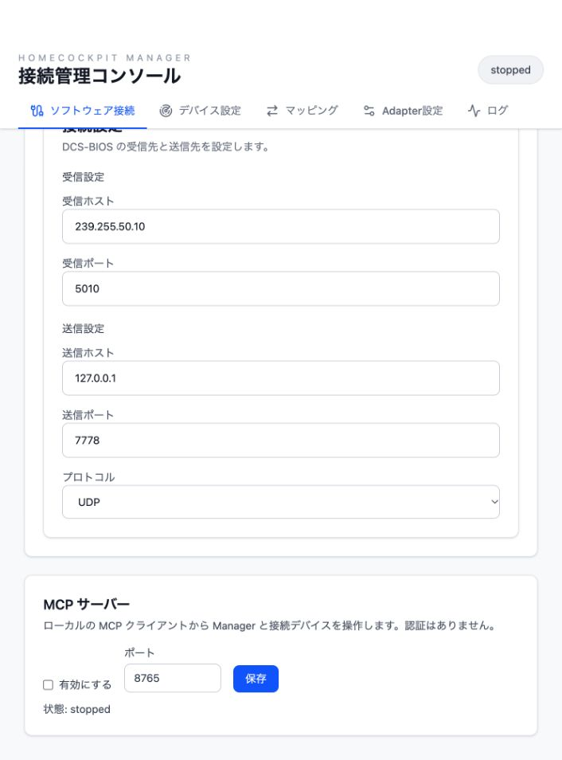

# HomeCockpit Manager

Manager is a Tauri desktop application. Its Next.js frontend is exported as static files; DCS-BIOS and serial devices require the Tauri runtime.

## MCP server

Open **ソフトウェア接続 → MCP サーバー**, enable the server, and save. It is disabled by default. The default endpoint is `http://127.0.0.1:8765/mcp`; the port can be changed from the same screen. Configure an MCP client with this URL and the **Streamable HTTP** transport. The setting is stored in Tauri's `manager-state.json` alongside the other Manager settings.

The endpoint listens only on `127.0.0.1` and accepts local `Host` and `Origin` values. It has no authentication. Any local process able to connect can change Manager settings and send commands to DCS or attached hardware. Disabling the setting stops the listener. Bind failures appear in the Manager UI and log.

The server exposes Tools only:

| Tool | Input | Result |
| --- | --- | --- |
| `manager_snapshot` | none | Current state, configuration, logs, and devices |
| `manager_logs` | none | Recent Manager log entries |
| `manager_devices` | none | Discovered device summaries |
| `manager_scan_serial_ports` | none | Probed, unconfigured serial port candidates |
| `manager_preview_adapter_profile` | `request` | Parsed profile without saving |
| `manager_start_learn` | `request` | Snapshot with active learning session |
| `manager_cancel_learn` | none | Snapshot after cancellation |
| `manager_refresh_devices` | none | Rescanned device summaries |
| `manager_trigger_role_input` | `roleId`, `logicalControlId`, `eventKind` | Number of dispatched adapter actions |
| `manager_save_dcsbios_config` | `config` | Updated Manager snapshot |
| `manager_save_endpoints` | `deviceEndpoints` | Updated Manager snapshot |
| `manager_save_role_assignments` | `deviceRoleAssignments` | Updated Manager snapshot |
| `manager_save_adapter_mappings` | `adapterMappings` | Updated Manager snapshot |
| `manager_save_adapter_profile` | `request` | Updated Manager snapshot |
| `dcsbios_status` | none | Config, status, and connection diagnostics |
| `dcsbios_memory_read` | `address`, `length` (1–512) | Received memory bytes as `hex` |
| `dcsbios_recent_packets` | optional `sinceId`, `limit` | Recent received UDP datagram previews |
| `dcsbios_packet_read` | `id` from recent packets | Full retained UDP datagram as `hex` |
| `dcsbios_start`, `dcsbios_stop` | none | Updated listener status |
| `dcsbios_send_command` | `rawCommand`, or `controlId` and `argument` | `sent`, transport, and unknown simulator application state |
| `hcp_encode` | `kind` (`data` or `set`), `packet` | Encoded HCP `hex` |
| `hcp_decode` | `hex` | Decoded HCP packet |
| `hcp_send` | `deviceId`, `kind`, `packet` | Endpoint write result |
| `imcp_encode` | frame fields | Encoded wire `hex` |
| `imcp_decode` | wire `hex` | Decoded frame fields |
| `imcp_send` | `endpointId`, `frame` | Endpoint write result |
| `imcp_recent_frames` | optional `endpointId`, `sinceId`, `limit` | Received IMCP frames, parse errors, and MCP writes |
| `hcp_recent_packets` | optional `endpointId`, `sinceId`, `limit` | Decoded HCP packets in recent IMCP traffic |

The save Tools accept the same JSON field names and shapes as `AppSnapshot` and the Tauri commands. `hcp_encode` and `hcp_send` take `DisplayData` as `packet` for `kind: "data"`, or an HCP `AppPacketKind` for `kind: "set"`. The latter uses Serde's tagged form, for example `{"ControlEvent":{"seq":0,"control_id":65280,"event":"RequestDeviceHello"}}`. HCP's byte limit is 128.

IMCP frame fields are `to` and `from` (byte values), `kind` (`ping`, `pong`, `ack`, `join`, `setAddress`, `data`, or `set`), and fields required by that kind: `address` for ACK, `id` for Join, both for SetAddress, or `payloadHex` for Data/Set. For example, `imcp_encode` can receive `{"to":255,"from":1,"kind":"ping"}`. `imcp_send` wraps the same frame under `frame` and adds `endpointId`. Arbitrary frame sends can affect IMCP address assignment or the device state.

An endpoint write result confirms bytes were written to the serial transport. It does not prove an IMCP ACK or that the device applied the request. DCS-BIOS import sends likewise do not prove the simulator changed state; check its export value or cockpit state. `dcsbios_memory_read` returns only ranges already received by Manager.

Trace tools return arrays in observation order. `id` is a process-local cursor: pass the last observed `id` as `sinceId` to read later entries. `limit` defaults to 50 and allows 1–128 entries; each trace keeps the latest 128 entries in memory. DCS packet previews contain at most 256 bytes in `hexPreview`; `truncated` marks a longer datagram. Use `dcsbios_packet_read` for its complete hex bytes while the ID remains in the trace. `startsWithSync` only reports whether the datagram starts with a DCS-BIOS sync marker (continuation datagrams can validly omit it). IMCP entries include `direction` (`rx` or `tx`), frame fields, and optional decoded `hcp` or `decodeError`. The TX trace records writes requested through the MCP endpoint queue; automatic Manager protocol writes are not included. A received ACK can be observed in `imcp_recent_frames`, but it is not automatically correlated with a prior send or proof that a command was applied. The trace is cleared when Manager exits.

## Development checks

Run `pnpm run build` in `manager/`. Run `cargo test --locked`, `cargo fmt --all -- --check`, and `cargo clippy --locked --lib --bins -- -D warnings` in `manager/src-tauri/`.
